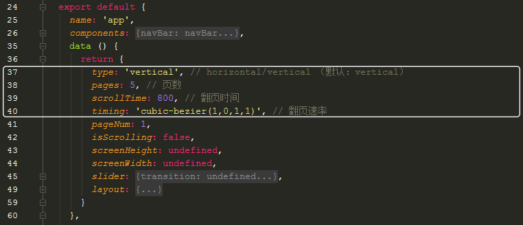

# vue-fullpage
  [vue-fullpage模版预览](https://renkles.github.io/template/dist/index.html)

## images
    

## Project setup
```
npm install
```

### Compiles and hot-reloads for development
```
npm run serve
```

### Compiles and minifies for production
```
npm run build
```
